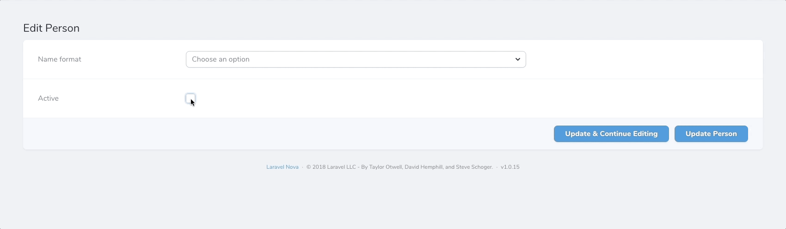

# Nova Dependency Container

[](https://packagist.org/packages/outl1ne/nova-dependency-container)
[](https://packagist.org/packages/outl1ne/nova-dependency-container)
[](https://github.com/outl1ne/nova-dependency-container/blob/master/LICENSE.md)

This [Laravel Nova](https://nova.laravel.com) package adds a container for grouping fields that depend on other fields' values.

## Requirements

- `php: >=8.0`
- `laravel/nova: ^4.0`

## Screenshots


## Installation

Install the package in a Laravel Nova project via Composer:

```bash
composer require outl1ne/nova-dependency-container
```

## Usage

1. Add the `Outl1ne\DependencyContainer\HasDependencies` trait to your Nova Resource.
2. Add the `Outl1ne\DependencyContainer\DependencyContainer` field to your Nova Resource.
3. Add the `Outl1ne\DependencyContainer\ActionHasDependencies` trait to your Nova Actions that you wish to use dependencies on.

```php
class Page extends Resource
{
    use HasDependencies;

    public function fields(Request $request)
    {
        return [

            Select::make('Name format', 'name_format')->options([
                0 => 'First Name',
                1 => 'First Name / Last Name',
                2 => 'Full Name'
            ])->displayUsingLabels(),

            DependencyContainer::make([
                Text::make('First Name', 'first_name')
            ])->dependsOn('name_format', 0),

        ];
    }
}
```

### Dependencies

The package supports four kinds of dependencies:

1. `->dependsOn('field', 'value')`
2. `->dependsOnNot('field', 'value')`
3. `->dependsOnEmpty('field')`
4. `->dependsOnNotEmpty('field')`
5. `->dependsOnNullOrZero('field')`

These dependencies can be combined by chaining the methods on the `DependencyContainer`:

```php
DependencyContainer::make([
  // dependency fields
])
->dependsOn('field1', 'value1')
->dependsOnNotEmpty('field2')
->dependsOn('field3', 'value3')
```

The fields used as dependencies can be of any Laravel Nova field type. Currently only two relation field types are supported, `BelongsTo` and `MorphTo`.

Here is an example using a checkbox:



### BelongsTo dependency

If we follow the example of a _Post model belongsTo a User model_, taken from Novas documentation [BelongsTo](https://nova.laravel.com/docs/2.0/resources/relationships.html#belongsto), the dependency setup has the following construction.

We use the singular form of the `belongsTo` resource in lower case, in this example `Post` becomes `post`. Then we define in dot notation, the property of the resource we want to depend on. In this example we just use the `id` property, as in `post.id`.

```php
BelongsTo::make('Post'),

DependencyContainer::make([
    Boolean::make('Visible')
])
->dependsOn('post.id', 2)
```

When the `Post` resource with `id` 2 is being selected, a `Boolean` field will appear.

### BelongsToMany dependency

A [BelongsToMany](https://nova.laravel.com/docs/2.0/resources/relationships.html#belongstomany) setup is similar to that of a [BelongsTo](https://nova.laravel.com/docs/2.0/resources/relationships.html#belongsto).

The `dependsOn` method should be pointing to the name of the intermediate table. If it is called `role_user`, the setup should be

```php
BelongsToMany::make('Roles')
	->fields(function() {
		return [
			DependencyContainer::make([
			    // pivot field rules_all
			    Boolean::make('Rules All', 'rules_all')
			])
			->dependsOn('role_user', 1)
		]
	}),
```

If the pivot field name occurs multiple times, consider using [custom intermediate table models](https://laravel.com/docs/6.x/eloquent-relationships#defining-custom-intermediate-table-models) and define it in the appropiate model relation methods. The only reliable solution I found was using mutators to get/set a field which was being used multiple times. Although this may seem ugly, the events which should be fired on the intermediate model instance, when using an Observer, would work unreliable with every new release of Nova.

> If Nova becomes reliable firing eloquent events on the intermediate table, I will update this examples with a more elegant approach using events instead.

Here is an (ugly) example of a get/set mutator setup for an intermediate table using a pivot field called `type`.

```php
// model User
class User ... {

   public function roles() {
   		return $this->belongsToMany->using(RoleUser::class)->withPivot('rules_all');
   }

}

// model Role
class Role ... {

   public function users() {
   		return $this->belongsToMany->using(RoleUser::class)->withPivot('rules_all');
   }

}

// intermediate table
use Illuminate\Database\Eloquent\Relations\Pivot;
class RoleUser extends Pivot {

	protected $table 'role_user';

	public function getType1Attribute() {
	    return $this->type;
	}

	public function setType1Attribute($value) {
		$this->attributes['type'] = $value;
	}

	// ... repeat for as many types as needed
}
```

And now for the dependency container.

```php
->fields(function() {
	return [
		DependencyContainer::make([
		    // pivot field rules_all
		    Select::make('Type', 'type_1')
		    	->options([
		    		/* some options */
	    		])
		    	->displayUsingLabels()
		])
		->dependsOn('role_user', 1)
		,

		DependencyContainer::make([
		    // pivot field rules_all
		    Select::make('Type', 'type_2')
		    	->options([
		    		/* different options */
	    		])
		    	->displayUsingLabels()
		])
		->dependsOn('role_user', 2)
		,

		// .. and so on
	]
}),
```

### MorphTo dependency

A similar example taken from Novas documentation for [MorphTo](https://nova.laravel.com/docs/2.0/resources/relationships.html#morphto) is called commentable. It uses 3 Models; `Comment`, `Video` and `Post`. Here `Comment` has the morphable fields `commentable_id` and `commentable_type`

For a `MorphTo` dependency, the following construction is needed.

`Commentable` becomes lower case `commentable` and the value to depend on is the resource singular form. In this example the dependency container will add two additional fields, `Additional Text` and `Visible`, only when the `Post` resource is selected.

```php
MorphTo::make('Commentable')->types([
    Post::class,
    Video::class,
]),

DependencyContainer::make([
    Text::make('Additional Text', 'additional'),
    Boolean::make('Visible', 'visible')
])
->dependsOn('commentable', 'Post')
```

## License

This project is open-sourced software licensed under the [MIT license](LICENSE.md).
